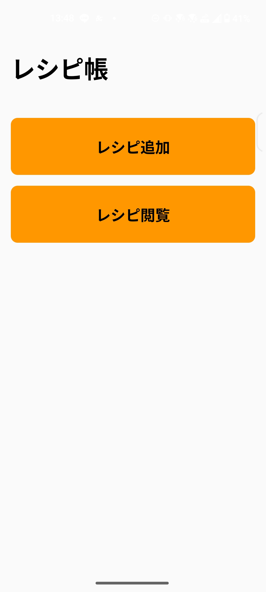
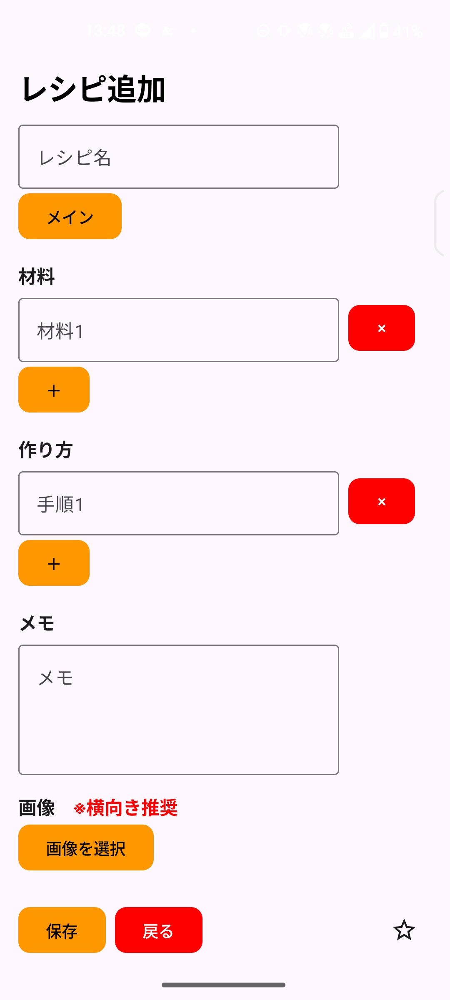
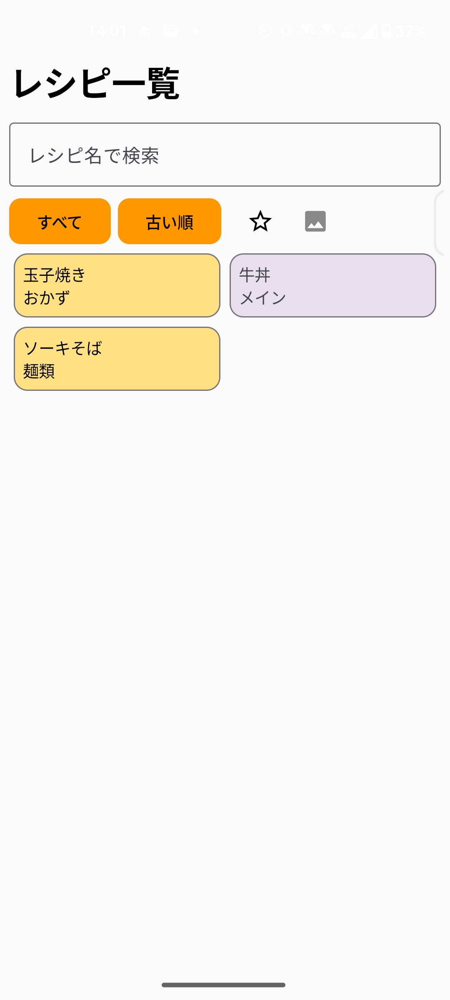
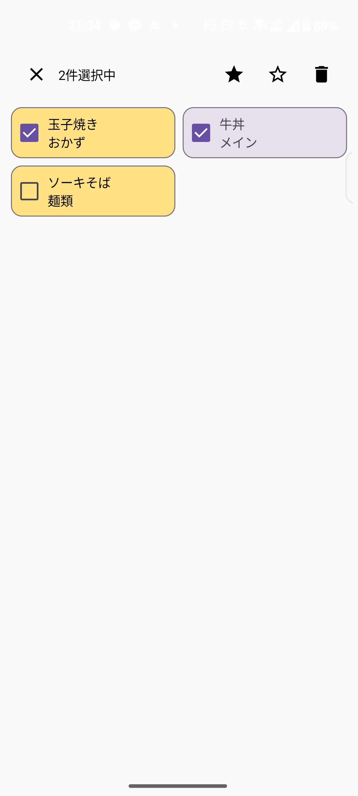
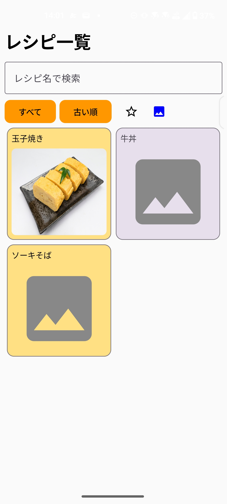
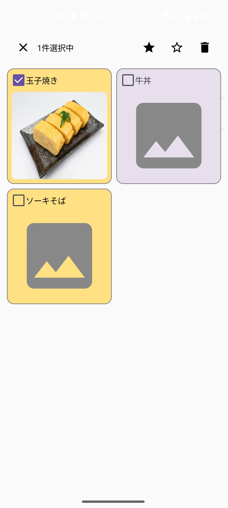
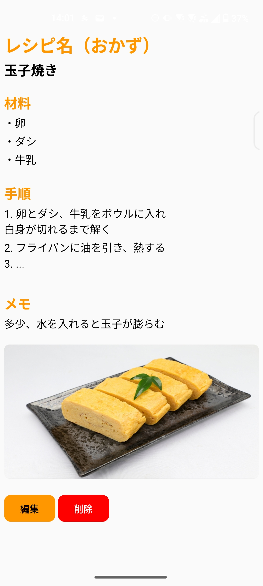
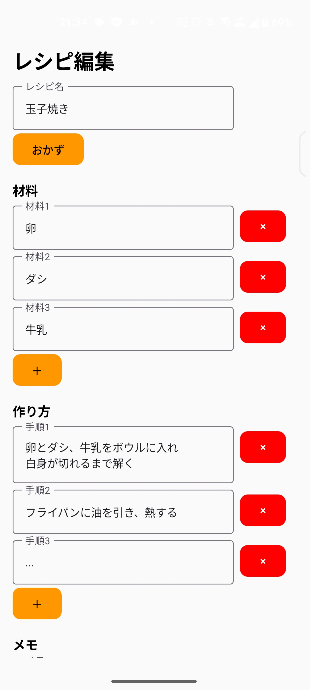

# レシピ帳 (Recipe Note)

Android向けレシピ管理アプリです。

Google Play:
（公開後にURL）

## 使用技術

- Kotlin
- Jetpack Compose
- Material3
- Navigation Compose
- Room
- Kotlin Coroutines
- Flow / StateFlow
- Hilt
- Coil
- MVVM Architecture

## スクリーンショット

<table>
<tr>
<td align="center"><b>ホーム</b></td>
<td align="center"><b>追加</b></td>
<td align="center"><b>一覧</b></td>
<td align="center"><b>複数選択</b></td>
</tr>

<tr>
<td></td>
<td></td>
<td></td>
<td></td>
</tr>
</table>

<table>
<tr>
<td align="center"><b>画像表示</b></td>
<td align="center"><b>複数選択</b></td>
<td align="center"><b>詳細</b></td>
<td align="center"><b>編集</b></td>
</tr>

<tr>
<td></td>
<td></td>
<td></td>
<td></td>
</tr>
</table>

## 主な機能

### レシピ管理
- レシピの登録・編集・削除
- 一括お気に入り・削除

### 材料・作り方
- 材料を複数登録
- 作り方を複数登録
- 動的な追加・削除

### 画像
- ギャラリーから画像を選択
- カメラで撮影した画像を登録
- レシピ一覧で画像の表示・非表示を切り替え

### 検索・整理
- キーワード検索
- ジャンルによる分類
- ソート機能
- お気に入り登録

### アーキテクチャ
- Room Databaseによるローカル保存
- Hiltを利用した依存性注入
- MVVMアーキテクチャ

## 工夫した点

### 保守性・再利用性
- MVVMアーキテクチャを採用し、UIとビジネスロジックを分離
- Hiltによる依存性注入を導入し、保守性・拡張性を向上
- Room + Flowを利用し、データ変更をリアクティブにUIへ反映

### UI設計
- Jetpack Composeによる宣言的UIを採用
- Material3デザインに対応
- ComposeとStateFlowを組み合わせた状態管理
- CommonDialogを共通コンポーネント化
- RecipeButtonを共通コンポーネント化
- GenreDropDownを共通コンポーネント化

### 機能面
- カメラ撮影・ギャラリー選択の両方に対応
- レシピ一覧の画像表示ON/OFF機能を実装
- キーワード検索・ジャンル検索・ソート機能を実装
- 複数選択による一括お気に入り・削除に対応

## 今後の改善予定

- 材料でのレシピ検索
- タグ機能
- UI/UX改善
- クラウド同期